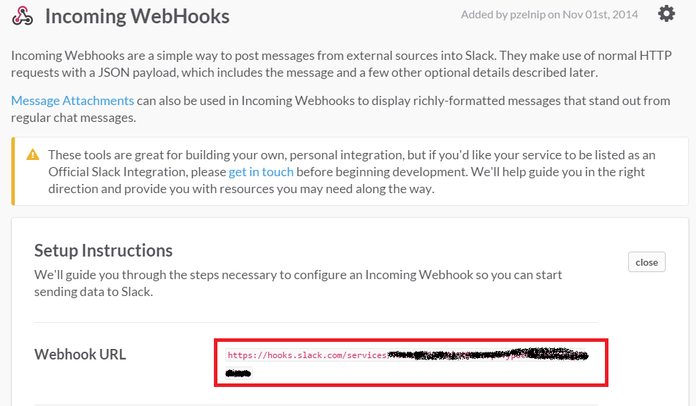

# slackcmd

A Python script for piping output from the command line to a [Slack](http://slack.com) channel.

## Example

```
ls | python slackcmd.py -c '#myChannel' 
```

Would pipe the contents of the current directory to the channel ```#myChannel```.

## Installation

Just throw the slackcmd.py script somewhere in your path, and make sure the [```requests``` library for Python](http://docs.python-requests.org/en/latest/) is installed.  If you have ```pip```, then it's as easy as:

```
pip install requests
```

Alternatively, in the code there is commented out equivalent standard library implementations, but this isn't really supported or tested.

## Usage

```
usage: slackcmd.py [-h] [-u URL] -c CHANNEL [-n USER] [-e EMOJI]

Talk to Slack

optional arguments:
  -h, --help            show this help message and exit
  -u URL, --url URL     Slack Incoming Webhooks integration webhook URL. If
                        the environment variable SLACK_WEBHOOK_URL is set,
                        will read this value from there
  -c CHANNEL, --channel CHANNEL
                        Channel to post to
  -n USER, --user USER  Name of the user to post as, defaults to "CmdLine"
  -e EMOJI, --emoji EMOJI
                        Emoji to use for the message
```

To find your webhooks URL, in Slack add the "Incoming Webhooks" integration, and in 
the instructions will be given a "Webhook URL".  This is the URL to use.  Here's a
screenshot showing where to get it:



You can either specify this URL on the command-line via the -u switch, but it's much 
more convenient to set the ```SLACK_WEBHOOK_URL``` environment variable.  On a *nix
environment adding something like:

```
SLACK_WEBHOOK_URL="https://pzelnip.slack.com/services/hooks/incoming-webhook?token=Ta4BRUMStaB5ahT4Y76eT1Hi"
export SLACK_WEBHOOK_URL
```

To your ```.bashrc``` would do the trick.  On a Windows box, opening up a command prompt and doing something like:

```
set SLACK_WEBHOOK_URL=https://pzelnip.slack.com/services/hooks/incoming-webhook?token=Ta4BRUMStaB5ahT4Y76eT1Hi
```

would work.
